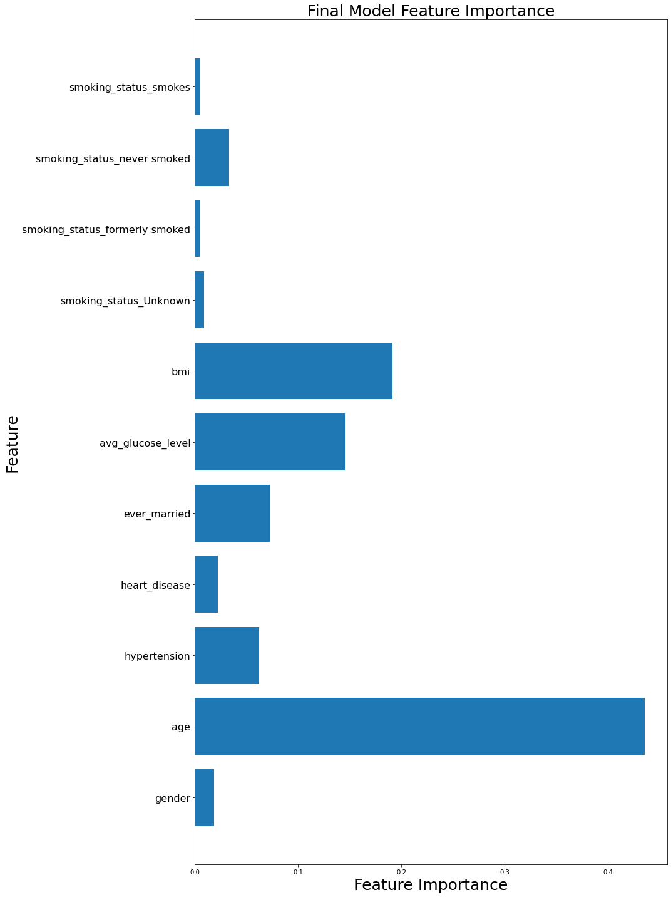

# Brain-Stroke-Model

The dataset used for this project "Brain Stroke dataset" from kaggle.com

Number of records: 4981
Number of columns: 11
Target variable: churn

# Stakeholder
Healthcare Providers.

# Project Objective
The primary goal of this project is to develop a predictive model that can accurately identify individuals at high risk of having a stroke based on various health and demographic factors. By leveraging this model, healthcare providers can proactively manage and mitigate stroke risks, ultimately improving patient outcomes and reducing healthcare costs associated with stroke-related treatments and complications.

# Data Cleaning
- Checking for missing values within the dataset. 
- Checking for duplicates.

# Feature Engineering
- Converting columns of the object data types, to a numerical data type.
- Dropping columns that were not pertinent to this project or to the business question ('work_type','Residence_type').
- Used MinMax Scaling.
 

# Models
Baseline model: Logistic regression
Model 2: Decision tree
Model 3: Knn
Model 4: Random forest

# Evaluation Metric
I have decided to use Recall as the evaluation metric for this project. Recall is calculated by dividing the number of true positives by the sum of true positives and false negatives. It measures the proportion of actual positive instances that are correctly identified. I selected this metric because our goal is to identify as many positive instances as possible, making it the most suitable choice when dealing with imbalanced data.

## Feature Importance
---
Next, I took a look at feature importance, to get a better idea what features contributed to people having a stroke.

# Logistic Regression

Recall Score (Train): 80%

Recall Score (Test): 82%

# Decision Tree

Recall Score (Train): 81%

Recall Score (Test):74%

# KNN

Recall Score (Train):87%

Recall Score (Test):78%

# KNN With GridSearchCV

Recall Score (Train):85%

Recall Score (Test):84%

# Random Forest

Recall Score (Train):90%

Recall Score (Test):84%

# Random Forest with GridSearchCV:

Recall Score (Train):90%

Recall Score (Test):82%

## Best Model Selection
Considering both the recall on the training and test sets, the KNN with GridSearchCV and Random Forest (without GridSearchCV) models are the top contenders:

- KNN with GridSearchCV: 85% recall on training, 84% recall on test.
- Random Forest: 90% recall on training, 84% recall on test.

Both models perform equally well on the test set. However, the KNN with GridSearchCV has a smaller gap between training and test recall, suggesting it might generalize slightly better without as much overfitting compared to the Random Forest.

## Recommendations
- Deploy the KNN with GridSearchCV model due to its balanced and high recall scores.
- Continuously monitor and update the model with new data to maintain performance.
- Analyze feature importance and collect additional data to enhance model accuracy.
- Use resampling techniques and cost-sensitive learning to handle imbalanced data.
- Develop a user-friendly interface and provide training for healthcare providers.
- Regularly evaluate the model for biases and ensure data privacy and security.

